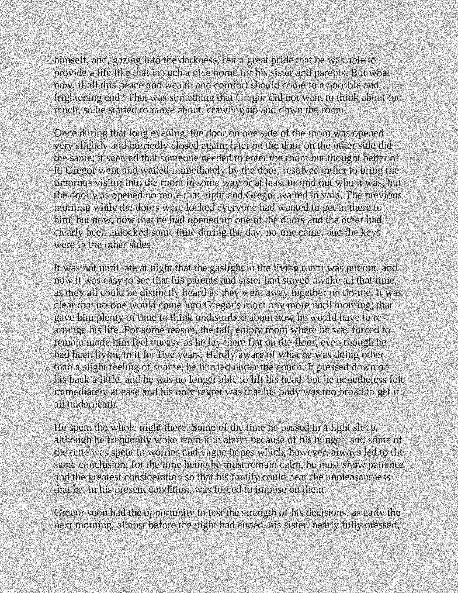
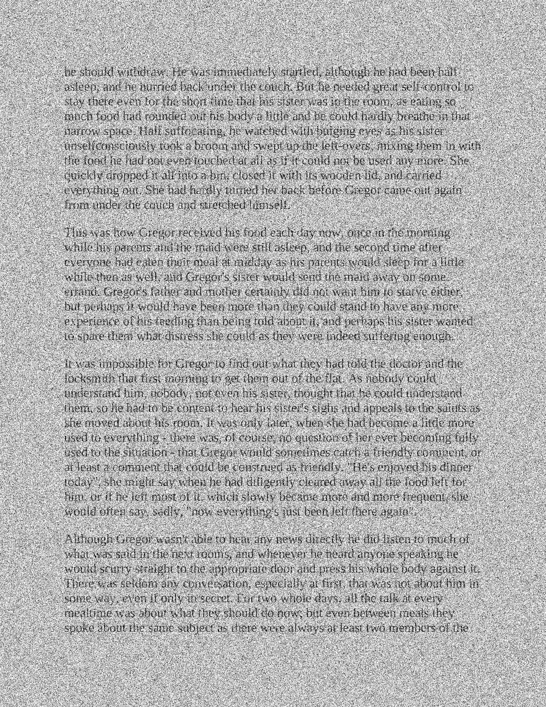
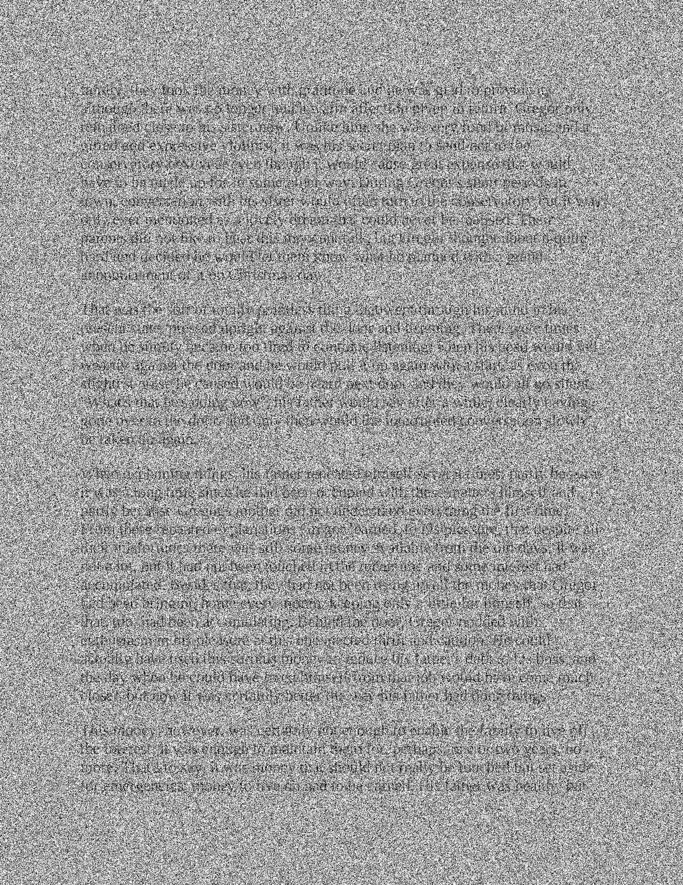

# Optical Character Recogniser

## Description
This project is meant to demonstrate machine learning algorithms and techniques to implement an OCR with high accuracy by making use of learning techniques and feature reduction algorithms to make it more efficient.

## Scenario
Given some PDF pages to test and bounding boxes for letters, the system takes in the data in the training mode and computes what are the features that are more relevant to identifying characters and stores these features to then use on test pages.

## Features
- Implemented in python
- K-Nearest neighbour classifier
- PCA (principal components) for feature reduction
- Spelling correction in the basic error detection function
- Forward sequential search

## To run
- Training stage:   `python code/train.py`
- Evaluation stage: `python code/evaluate.py dev`

## Results
97.4% Accuracy 
-------------
96.4% Accuracy 
-------------
86.2% Accuracy 
-------------
60.4% Accuracy 
-------------
60.9% Accuracy 
-------------
50.7% Accuracy 
-------------
